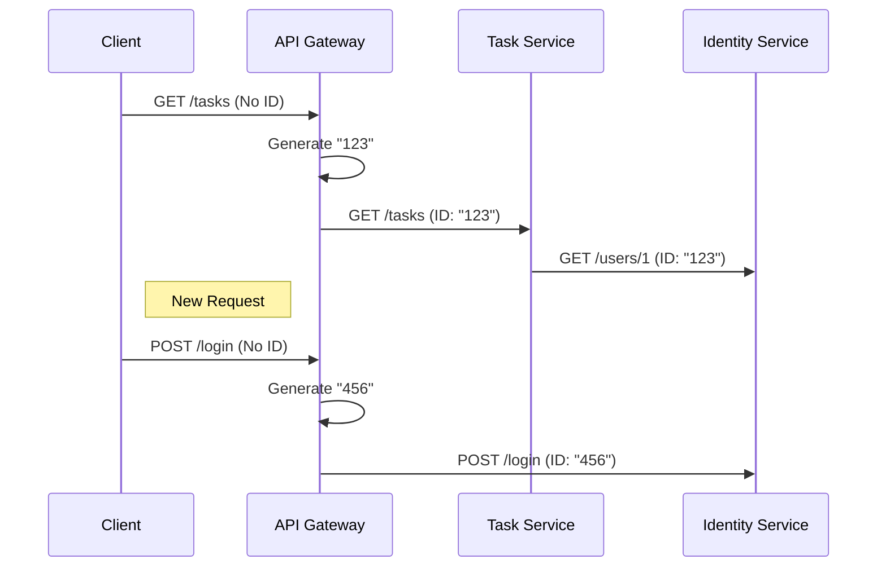

## **Introduction**

In a distributed microservices architecture, tracing requests across services is crucial for debugging and observability. **Correlation IDs** help achieve this by assigning a unique identifier to each request, which propagates through one service to another.

In this article, I’ll walk through how I implemented **correlation ID-based logging** in my [DeeptechHub](https://github.com/deepk1410/deeptechhub) project, which consists of:
✅ `identity-service` (Authentication & User Management)
✅ `task-service` (Task Management)
✅ `common-lib` (Shared Utilities)

* * *

## **1\. Why Correlation IDs?**

### **Challenges Without Correlation IDs**

*   **Hard to Trace Requests**: When a request flows through multiple services, logs are scattered.

*   **Debugging Nightmares**: No easy way to correlate errors across services.

*   **No End-to-End Visibility**: Difficult to track performance bottlenecks.


### **Solution: Correlation IDs**

*   **Unique ID per Request**: Generated at the entry point (API Gateway/First Service).

*   **Propagated Across Services**: Via HTTP Headers (`X-Correlation-Id`).

*   **Logged Consistently**: Attached to every log entry.

*   Note: In the below diagram Api-gateway has been added to illustrate typical microservice flow




* * *

## **2\. Implementation Steps**

Folder Structure

```xml
deeptechhub/
├── common-lib/
│   ├── src/main/java/com/deeptech/common/logging/
│   │   ├── CommonApplicationConstants.java          # CORRELATION_ID_HEADER
│   │   └── CorrelationIdFilter.java      # Servlet Filter
├── identity-service/
│   ├── src/main/java/com/deeptech/identityservice/config/
│   │   └── LoggingConfig.java            # FilterRegistrationBean
│   └── src/main/resources/
│       └── logback-spring.xml            # JSON Logging
└── task-service/
    ├── src/main/java/com/deeptech/taskservice/config/
    │   ├── FeignConfig.java              # Feign Interceptor
    │   └── LoggingConfig.java
    └── src/main/resources/
        └── logback-spring.xml
```

### **🔹 Step 1: Add Dependencies**

#### **In** `common-lib/pom.xml` (For MDC & Servlet API)

```xml
<!-- Spring Web for OncePerRequestFilter, HttpServletRequest, etc. -->
<dependency>
    <groupId>org.springframework</groupId>
    <artifactId>spring-web</artifactId>
</dependency>

<!-- Jakarta Servlet API -->
<dependency>
    <groupId>jakarta.servlet</groupId>
    <artifactId>jakarta.servlet-api</artifactId>
</dependency>

<!-- SLF4J Logging API -->
<dependency>
    <groupId>org.slf4j</groupId>
    <artifactId>slf4j-api</artifactId>
</dependency>
```

#### **In Each Service (**`identity-service`, `task-service`)

```xml
<!-- For JSON Logging -->
<dependency>
    <groupId>org.slf4j</groupId>
    <artifactId>slf4j-api</artifactId>
</dependency>

<dependency>
    <groupId>net.logstash.logback</groupId>
    <artifactId>logstash-logback-encoder</artifactId>
</dependency>
```

* * *

### **🔹 Step 2: Define Constants (In** `CommonConstants.java` of `common-lib`)

```java
public final class CommonApplicationConstants {
    public static final String CORRELATION_ID_HEADER = "X-Correlation-Id";
    public static final String CORRELATION_ID_MDC_KEY = "correlationId";

    private CommonApplicationConstants() {} // Prevent instantiation
}
```

* * *

### **🔹 Step 3: Create** `CorrelationIdFilter` (In `common-lib`)

*   This filter ensures a correlation ID is present in each request and logs it using MDC.


```java
@Component
@Order(Ordered.HIGHEST_PRECEDENCE) // Ensures - Filter runs before any logging is done by spring security filters
public class CorrelationIdFilter extends OncePerRequestFilter {
    @Override
    protected void doFilterInternal(HttpServletRequest request, HttpServletResponse response, FilterChain filterChain)
            throws ServletException, IOException {

        String correlationId = request.getHeader(CommonApplicationConstants.CORRELATION_ID_HEADER);
        if(StringUtils.isBlank(correlationId)) {
            correlationId = UUID.randomUUID().toString();
        }

        MDC.put(CommonApplicationConstants.CORRELATION_ID_MDC_KEY, correlationId);
        response.addHeader(CommonApplicationConstants.CORRELATION_ID_HEADER, correlationId);

        try {
            filterChain.doFilter(request, response);
        } finally {
            MDC.remove(CommonApplicationConstants.CORRELATION_ID_MDC_KEY); // Remove to avoid leaking between threads
        }

    }
}
```

* * *

### **🔹 Step 4: Register Filter in Each Service (**`LoggingConfig.java`)

*   In each service, create a config class to register the filter.


```java
@Configuration
public class LoggingConfig {
    @Bean
    public FilterRegistrationBean<CorrelationIdFilter> correlationIdFilter() {
        FilterRegistrationBean<CorrelationIdFilter> registration = new FilterRegistrationBean<>();
        registration.setFilter(new CorrelationIdFilter());
        registration.addUrlPatterns("/*");
        registration.setOrder(1); // High priority
        return registration;
    }
}
```

* * *

### **🔹 Step 5: Propagate Correlation ID in Feign Clients (**`FeignConfig.java`)

*   If one service calls another via Feign, pass the correlation ID along in the request header:


```java
@Configuration
public class FeignConfig {
    @Bean
    public RequestInterceptor correlationIdInterceptor() {
        return template -> {
            String correlationId = MDC.get(CommonConstants.CORRELATION_ID_MDC_KEY);
            if (correlationId != null) {
                template.header(CommonConstants.CORRELATION_ID_HEADER, correlationId);
            }
        };
    }
}
```

* * *

### **🔹 Step 6: Configure Logback (**`logback-spring.xml`)

*   Define logging configurations, formats and rules in the logback-spring.xml inside each service.

*   Configurations can be set customized using profiles.


```xml
<?xml version="1.0" encoding="UTF-8"?>
<configuration>
    <include resource="org/springframework/boot/logging/logback/defaults.xml"/>
    <springProperty name="appName" source="spring.application.name"/>
    <springProperty name="profile" source="spring.profiles.active"/>

    <appender name="CONSOLE_JSON" class="ch.qos.logback.core.ConsoleAppender">
        <encoder class="net.logstash.logback.encoder.LogstashEncoder">
            <includeContext>false</includeContext>
            <includeMdc>true</includeMdc>
            <customFields>{"service":"${appName}"}</customFields>
        </encoder>
    </appender>

    <springProfile name="dev,local,docker,test">
        <appender name="FILE" class="ch.qos.logback.core.FileAppender">
            <file>logs/${appName}-${profile}.log</file>
            <append>true</append>
            <encoder>
                <pattern>%d{yyyy-MM-dd HH:mm:ss} [%thread] %-5level [%X{correlationId}] %logger{36} - %msg%n</pattern>
            </encoder>
        </appender>
        <root level="DEBUG">
            <appender-ref ref="CONSOLE_JSON"/>
            <appender-ref ref="FILE"/>
        </root>
    </springProfile>

    <springProfile name="prod">
        <root level="INFO">
            <appender-ref ref="CONSOLE_JSON"/>
        </root>
    </springProfile>

    <!-- Default root logger if no profile is active -->
    <root level="INFO">
        <appender-ref ref="CONSOLE_JSON"/>
    </root>
</configuration>
```

* * *

## **3\. Testing the Implementation**

### **🔹 Verify Log Output**

```json
{
  "timestamp": "2024-05-25T12:00:00.000Z",
  "level": "INFO",
  "service": "identity-service",
  "correlationId": "a1b2c3d4-e5f6-7890",
  "message": "User authenticated"
}
```

### **🔹 Integration Test**

*   Verify that when request contains correlationId, response contains the same.


```java
@Test
@WithMockUser(username = "testuser")
    void shouldIncludeCorrelationIdInResponse() throws Exception {
            mockMvc.perform(get("/api/users/username/testuser")
            .header(CommonApplicationConstants.CORRELATION_ID_HEADER, "test-123"))
            .andExpect(status().isOk())
            .andExpect(header().exists(CommonApplicationConstants.CORRELATION_ID_HEADER))
            .andExpect(header().string(
            CommonApplicationConstants.CORRELATION_ID_HEADER,
            "test-123"
            ));
            }
```

* * *

## **4\. Key Takeaways**

✅ **Centralized** `common-lib` keeps code DRY.
✅ **Spring-free core** ensures portability.
✅ **Structured JSON logs** work seamlessly with ELK/Grafana.
✅ **Feign interceptor** maintains correlation across services.

* * *

## **Next Steps**

1.  **Add API Gateway** to centralize correlation ID generation.

2.  **Integrate with Grafana** for log visualization.

3.  **Extend to async tasks** (e.g., `@Async`, Kafka).


**GitHub Commit:** [084db27](https://github.com/deepak1410/deeptechhub/commit/084db2712c496c1b82ca4eb8868d7eeb45b3d424)

* * *