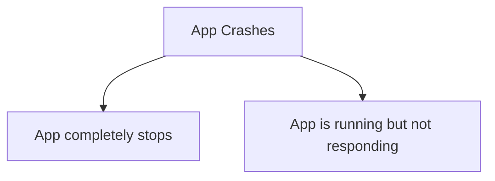

Troubleshooting Java applications is a critical skill for backend and full‑stack developers. When systems grow complex—microservices, ORMs, async processing, containers—issues rarely come with clear error messages. Instead, you must observe, compare, and reason.

**Definition:** *"Troubleshooting means understanding how a system behaves, comparing that to how it should behave, and then identifying what’s different.*"

This article walks through a practical, production‑oriented approach to troubleshooting Java applications, covering debugging, profiling, thread dumps, heap dumps, and distributed tracing.

## **Understanding App Crashes and Analysing app**

### **Understanding App Crashes**

App crashes can be of following 2 types:



**App Completely Stops or Crashes**

Symptoms:

* OutOfMemoryError, JVM crash, Process terminated


💡 Use a Heap Dump to investigate memory usage, leaks, and object retention.

**App Is Running but Not Responding**

Symptoms:

* Requests hang, High latency, CPU spikes or stalls


💡 Use a Thread Dump to understand thread states, locks, and deadlocks.

### **Analysing app by Reading Code**

Reading code is inherently difficult because it happens in two dimensions:

1. Vertical flow – reading code top to bottom

2. Depth exploration – diving into methods, frameworks, and libraries


→ Troubleshooting complements code reading by showing how the code actually behaves at runtime.

## **Debugging Java applications techniques**

**How Java Debugging Works**

When you run a Java app in debug mode, the JVM starts with special flags that allow debugger connections. Your IDE communicates with the JVM using JDWP (Java Debug Wire Protocol).

This allows you to - Pause execution, Step through code, Inspect variables, and Modify runtime values.

### **Conditional Breakpoints**

A conditional breakpoint pauses execution only when a condition is met.

Example use cases:

* Break only when variable `i == 20`

* Stop on the `n`th iteration


### **Non‑Suspending Breakpoints with Logging**

Instead of stopping execution, you can log values when a breakpoint is hit. This is extremely useful when:

* Debugging loops

* Avoiding performance impact

* Mimicking lightweight tracing


### **Dynamically Modifying Variables**

Modern IDEs allow you to change variable values at runtime during debugging—useful for testing edge cases without restarting the app.


## Understanding Memory Issues

When there is a memory leak in your app, the used memory keeps growing continuously. GC tries to deallocate unused data from memory but it does too few. Eventually the app crashes with OutOfMemoryError. Below example shows the difference between a normal and an abnormal behaviour.


Picture source: Troubleshooting Java book by Laurențiu Spilcă

## **Profiling Java Applications with VisualVM**

Profiling helps answer the question - Where is my application spending time and memory? In this article we are using VisualVM to profile which is a powerful free tool.

### **Setting up VisualVM**

1. Download VisualVM from the official site

2. Extract it locally

3. Update JDK path in etc/visualvm.conf


```bash
visualvm_jdkhome="C:\Program Files\Amazon Corretto\jdk25.0.1_8"
```

4. Run VisualVM from the bin directory


## **Sampling vs Profiling (Instrumentation)**

### **Sampling**

Sampling periodically observes stack traces with minimal overhead.

It helps identify:

* What code executes

* Which methods consume most time

* CPU vs waiting time


💡 Sampling is ideal for initial investigation.

### **Profiling (Instrumentation)**

Profiling instruments bytecode to capture fine‑grained execution details.

* More detailed information

* Higher overhead

* Must be limited to specific packages


💡 Use profiling only after sampling narrows down the problem area.

## **Applying Profiling in Practice**

If Running web service, set the `VM Option` as follows: `-Djava.rmi.server.hostname=`[`localhost`](http://localhost)

### **CPU Profiling**

Use CPU profiling to:

* Identify slow methods

* Investigate latency issues

* Analyze call stacks


### **JDBC Profiling**

JDBC profiling reveals:

* SQL execution frequency

* Slow queries


⚠️ When using Hibernate, query counts may appear lower due to batching and caching.

### **Investigating Latency and Locks**

If total execution time is much higher than CPU time, the application is likely waiting.

**Common causes:**

* Thread contention

* Locks

* I/O waits

* Database calls


📸 Screenshot: Lock contention view that helps in finding DeadLock

This is where thread dumps become invaluable.

### **Thread Dumps**

A thread dump captures the state of all JVM threads at a point in time.

It helps diagnose:

* Deadlocks

* Thread starvation

* High CPU usage

* Stuck requests

* Zombie Threads

    * Zombie threads are threads that appear runnable but do no useful work. Common causes: Infinite loops, Busy waiting, Improper synchronization. Thread dumps help identify such patterns.


Thread dump can be collected using multiple ways:

* Using VisualVM

* Using CommandLine


#### **Get Thread dump using VisualVM**


📸 Screenshot: Thread dump overview

#### **Collecting Thread dump using CommandLine\*\***

* Step 1: Find Process ID


```bash
jps -l
```

📸 Screenshot: jps output

* Step 2: Capture Thread Dump and save into some file in some location(e.g. stack\_trace.tdump)


```bash
jstack <PID> > C:\stack_trace.tdump
```

* Step 3: Analyze Using Tools such as VisualVM

    


## **Memory Profiling and Heap Dumps**

Profiling memory works only when the app is running and responsive.

But what if:

* The app crashes immediately?

* The issue occurs only in production?


👉 This is where heap dumps shine.

**What Is a Heap Dump?**

A heap dump is a snapshot of all objects in JVM memory at a specific moment, including:

* Object instances

* References

* Retained sizes


### **Generating Heap Dumps**

Option 1: Automatically on OOM

Add JVM flags:

```bash
-XX:+HeapDumpOnOutOfMemoryError
-XX:HeapDumpPath=heapdump.bin
```

Example:

```bash
java -jar -XX:+HeapDumpOnOutOfMemoryError -XX:HeapDumpPath=heapdump.bin app.jar
```

Option 2: Using a Profiler


📸 Screenshot: Heap dump via VisualVM

Option 3: Command Line (jmap)

```bash
jmap -dump:format=b,file=C:/DA/heapdump.bin <PID>
```

### **Analyzing Heap Dumps with VisualVM**

Steps:

1. Load heap dump using `File > Load` on VisualVM.

2. Review HeapDump analysis summary view

    

3. Explore Objects View

    

    Ignore the primitives and inbuilt object types as they are side-effect and look at the custom data types defined in the project. In this example it’s the Product class.

    

    📸 Screenshots: Heap dump analysis views

4. Use OQL Console for advanced queries


## **Tracing Distributed Systems**

In microservices architectures, performance issues often span multiple services.

### **Distributed Tracing Tools**

* OpenTelemetry – Generates telemetry data (metrics, logs, traces)

* Jaeger / Zipkin – Collect and visualize traces


**How They Work Together**

1. OpenTelemetry instruments your Java services

2. Traces are exported to Jaeger or Zipkin

3. Each request appears as a timeline of spans across services


## Final Thoughts

Effective Troubleshooting Java applications requires choosing the right tools at the right time.

**Rule of thumb:**

* Debugger → Understand logic

* Profiler → Understand performance

* Thread dump → Understand concurrency

* Heap dump → Understand memory

* Tracing → Understand distributed flows


Mastering these techniques transforms you from someone who reacts to issues into someone who systematically diagnoses them.

Happy troubleshooting 🚀